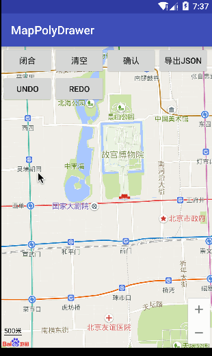
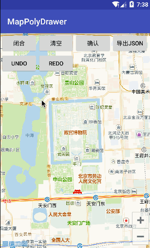

# 地图多边形绘制工具
*在手机地图上轻松绘制多边形*

有的时候我们需要在手机上设置一个经纬度范围，比如下面这样：

本项目就提供了一个易于交互的实现方式。

本项目非常容易与现有系统整合，而且可以轻松的在各种地图之间切换。范例项目包含了百度地图和高德地图两个实现。具体地图整合方式可以参考wiki（还没有）。

## 特性
- 支持绘制任意边型
- 支持JSON导出
- 支持undo，redo
- 易于整合多种地图

## API
- 参考wiki（还没有）

## 设计
系统设计参考了react+redux（是的，就是这两个前端框架），使用了[bansa](https://github.com/brianegan/bansa)这个类redux框架。而UI管理部分则是自己实现的简单的、以地图作为画布的、支持三种元素（地图点、地图多边形、地图折线）的框架。

我正在写一篇专门的blog来详细说明实现的步骤。

## TODO
- javadocs
- 维护wiki
- 整理成框架发布